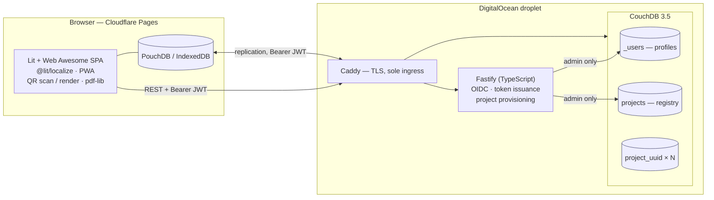

# Matter Manager

**Never lose a Matter commissioning QR code again.**

Matter smart-home devices are commissioned by scanning a QR code printed on the device or
its packaging. That code is routinely lost — the box is discarded, or the device ends up
mounted somewhere the label can no longer be read. Recovering from that means a factory
reset, and without the code, often a support call or a replacement device.

Matter Manager captures those codes once, enriches them with the metadata that makes them
findable later (room, type, name, installation date), and reproduces them on demand — on
screen or as a printable PDF you can file with the house documents.

> **Not a hub.** Matter Manager does not commission, control or monitor devices. It is a
> catalogue. It never talks to your devices, your network, or your fabric.

---

## Why this works: a Matter QR code is a string, not a picture

The code encodes a text payload — `MT:` followed by a Base38-encoded, bit-packed struct
holding a version, Vendor ID, Product ID, custom flow, discovery capabilities, a 12-bit
discriminator and a 27-bit setup passcode.

Two consequences shape the whole application:

1. **Storage is trivial and reproduction is exact.** Keep ~20 characters and the QR can be
   regenerated forever, at any size, on any medium.
2. **Metadata comes for free.** Decoding yields Vendor ID and Product ID, so manufacturer
   and product name can be filled in for you instead of typed.

---

## Features

|                   |                                                                                      |
| ----------------- | ------------------------------------------------------------------------------------ |
| **Scan**          | Camera capture with a manual-entry fallback for codes a camera cannot reach          |
| **Catalogue**     | Name, room, device type, installation date, serial, photos, timestamped remarks      |
| **Rooms**         | Hierarchical paths like `Ground Floor/Kitchen`, created inline while adding a device |
| **Reproduce**     | On-screen QR plus the numeric manual pairing code                                    |
| **PDF**           | Label sheets or a full inventory, grouped by room, all or selected devices           |
| **Offline-first** | Everything works with no connectivity — the basement is exactly where you need this  |
| **Projects**      | One per house or apartment, shared read-only or read-write with others               |
| **Multilingual**  | English and German, following browser language, overridable in your profile          |

---

## Status

**Pre-alpha — under active development.** Release 1.0 covers milestones M0–M5. See
[`docs/backlog/`](docs/backlog/) for the tracked breakdown and
[the design document](docs/superpowers/specs/2026-08-19-matter-manager-design.md) for the
full rationale.

---

## Architecture at a glance



**One CouchDB database per project.** CouchDB has no row-level read permission, so
per-project databases are the only way "share this house but not that one" can actually be
enforced. See [ADR 0003](docs/adr/0003-database-per-project.md).

**Only `project_<uuid>` is ever replicated to a browser.** The profile store and the project
registry are reachable through the API alone — a single readable registry would disclose
every project's address and participant list to every user
([ADR 0012](docs/adr/0012-central-project-registry.md)).

### Layout

Two halves and a contract between them.

| Directory      | Contains                                                              | Depends on |
| -------------- | --------------------------------------------------------------------- | ---------- |
| `frontend`     | The browser application — `src/domain`, `src/data`, `src/ui`           | nothing    |
| `backend`      | Fastify service, and its own pure domain in `src/domain`               | nothing    |
| `e2e`          | Playwright journeys against the built site                             | both       |
| `openapi.yaml` | The HTTP contract both sides are held to                               | —          |

**Each half installs, lints, typechecks, tests and builds on its own**, with its own
`package.json`, lockfile, `tsconfig`, Biome and Vitest configuration. `e2e` is self-contained
the same way, including its own `playwright.config.ts`. They share no package.
That is deliberate rather than tidy: ADR 0004 chose TypeScript partly to avoid writing domain
logic twice, the code has since shown no such sharing exists — the browser and the service
have one type alias in common and no functions — and so either side stays replaceable in
another language. `backend` in particular needs no Web Awesome token, which is what lets a
fork's backend pull request pass CI where the frontend's cannot.

Inside `frontend`, the three directories are what used to be three npm packages:

| Directory          | Contains                                             | Depends on   |
| ------------------ | ---------------------------------------------------- | ------------ |
| `src/domain`       | Matter codec, room paths, drafts, conflict merge      | **nothing**  |
| `src/data`         | PouchDB repositories, sync manager                    | `src/domain` |
| `src/ui`           | Lit SPA, routing, views, PDF, QR                      | both         |

Pure logic — no I/O, no DOM, no network — lives in `frontend/src/domain` for the browser and
`backend/src/domain` for the service. That is where almost all the logic that can be _wrong_
lives, and it runs in milliseconds with zero setup. If something needs a browser or a database
to test, that is a signal it belongs elsewhere. The purity is enforced, not requested: see
`frontend/tsconfig.domain.json` and `frontend/test/domain/purity.test.ts`.

---

## Getting started

### Prerequisite: a Web Awesome Pro token

The UI uses [Web Awesome Pro](https://webawesome.com), which is published only to Web
Awesome's own registry. Export your token before installing — `frontend/.npmrc` reads it from
the environment, and `npm ci` fails without it:

```bash
export WEBAWESOME_NPM_TOKEN=...   # from your Web Awesome account
```

Put it in your shell profile rather than in `.env`, so plain `npm ci`, the devcontainer and
your editor all see it. **Never write it into `.npmrc`** — this repository is public, and CI
fails the build if it finds a literal token there.

### Then

**With the devcontainer (recommended)** — VS Code will offer "Reopen in Container". CouchDB
comes up alongside, already configured, and your token is forwarded from the host shell.

**Without:**

```bash
npm ci                          # root tooling: Biome, for the files the root owns
npm ci --prefix frontend        # the application (needs the token above)
npm ci --prefix backend         # the service (needs no token)
npm ci --prefix e2e             # the end-to-end journeys (needs no token)
docker compose -f .devcontainer/docker-compose.yml up -d couchdb
npm run verify                  # everything, both halves
npm run dev                     # Vite dev server with HMR on http://localhost:5173
```

| Command              | Does                                                                                                                                                             |
| -------------------- | ---------------------------------------------------------------------------------------------------------------------------------------------------------------- |
| `npm run dev`        | Vite dev server for `frontend` with hot module replacement, on http://localhost:5173.                                                                     |
| `npm run build`      | Production bundle into `frontend/dist`. Typechecks first — both passes — because the deploy is the last place to find a type error.                        |
| `npm run preview`    | Serve the built bundle, to check it before deploying.                                                                                                     |
| `npm run verify`     | **Everything**: the repository-wide checks, then `frontend`'s own verify, then `backend`'s. CI adds coverage gates and the CouchDB contract checks.        |
| `npm run e2e`        | Playwright end-to-end suite against the built site                                                                                                        |
| `npm run check:fix`  | Auto-fix formatting and lint at the root. Each half has its own: `npm run check:fix --prefix frontend`.                                                    |

Anything that belongs to one half is run from that half — `npm test --prefix frontend`,
`npm run test:watch --prefix backend`. The root runs what spans them.

---

## Deployment

The web application is a static bundle, deployed to the **Cloudflare Pages** project
`matter-manager-app` **by direct upload** from GitHub Actions: a push to `main` goes to
production at `matter-manager-app.pages.dev`, and a hand-dispatched run against any other
branch gets a preview at `<branch>.matter-manager-app.pages.dev`. Pull requests are not
deployed — deploying a branch runs that branch's build with the Cloudflare token, so previews
are dispatched by somebody with write access rather than opened by anybody.

Full rationale, including the caching contract and why it is enforced by a checker, in
[ADR 0014](docs/adr/0014-cloudflare-pages-deployment.md).

### Secrets

| Secret                  | Scope                 | What                                                                               | Where         |
| ----------------------- | --------------------- | ---------------------------------------------------------------------------------- | ------------- |
| `WEBAWESOME_NPM_TOKEN`  | repository, **twice** | Web Awesome Pro registry token                                                     | CI and deploy |
| `CLOUDFLARE_API_TOKEN`  | organisation          | API token with **Account → Cloudflare Pages → Edit**, and nothing else             | deploy        |
| `CLOUDFLARE_ACCOUNT_ID` | organisation          | The account the Pages project lives in. Secret _or_ variable — it is not sensitive | deploy        |

`WEBAWESOME_NPM_TOKEN` goes into the **Actions** store _and_ the **Dependabot** store — the
same value in both. A Dependabot-triggered run cannot read the Actions store, so with the
value in only one place every Dependabot pull request fails `npm ci`, and the updater never
sees a Web Awesome release at all. [CONTRIBUTING](CONTRIBUTING.md#the-token-lives-in-two-stores-not-one)
explains why the stores are separate.

The two Cloudflare values are organisation secrets, so one rotation covers every repository
that deploys to the account. An organisation secret still has to _grant_ this repository
access — a secret that exists but is scoped to other repositories reads as empty here, which
looks identical to one that was never created. The deploy job checks for both before it builds
anything and says which is missing.

### One-time setup

The Pages project has to exist before the first deploy: `wrangler pages deploy` can create one
interactively, and an Actions runner is not a TTY, so it errors instead of prompting.

```bash
npx wrangler pages project create matter-manager --production-branch=main
```

`--production-branch` matters and is awkward to correct: a Direct Upload project's production
branch cannot be changed from the dashboard, only through the Update Project API. Set wrongly,
every deployment is a preview and nothing is ever live — which presents as a broken workflow
rather than as a wrong setting.

---

## Contributing

This project is developed test-first. Read [CONTRIBUTING.md](CONTRIBUTING.md) before opening
a PR — in particular the rule that **every test must be observed failing before the code
that makes it pass is written**.

## Security

Setup passcodes are stored unencrypted, protected by database isolation and transport
security. This is a deliberate, documented trade-off — read
[SECURITY.md](SECURITY.md) and [ADR 0005](docs/adr/0005-plaintext-payload-storage.md)
before deploying an instance that holds anyone's data but your own.

## License

[Apache-2.0](LICENSE)
