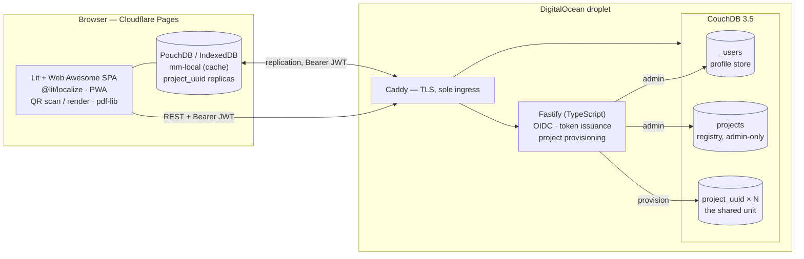

# Architecture

How Matter Manager is put together, and why. Decisions are recorded individually in
[`adr/`](adr/); this document is the map that connects them.

## The shape of the system



## The two paths, and why they are separate

Data reaches the server by **two independent routes**, and that is the single most important
structural fact about the system.

**Device data replicates browser-to-CouchDB directly.** It never touches the API. The
browser authenticates to CouchDB with a JWT that CouchDB validates itself using a public
key. Putting the API on that path would place it in front of every document write, make it
a failure point for synchronisation, and gain nothing — CouchDB already enforces
authorisation through `_security` and `validate_doc_update`.

**The API handles only what replication cannot**: proving who someone is, listing projects,
serving the profile, and creating databases the browser has no rights to create.

This is why the OpenAPI contract has no device endpoints. Their absence is the design.

## Authentication

The system uses OIDC, but **the identity provider's own JWT is never used as an API or
CouchDB credential.** It is exchanged, once, for a token this project issues.

Two reasons. Every OIDC provider shapes its claims differently, so accepting them directly
would push provider-specific handling into CouchDB's `_security` and into every
authorisation check — and adding Facebook later would mean revisiting all of it. And CouchDB
must validate these tokens itself, which means we control the signing key and the claim
names, not Google.

Our tokens are **ES256** (EC P-256) rather than RS256: substantially smaller signatures on
every replication request, for equivalent security.

```mermaid
sequenceDiagram
  participant U as Browser
  participant A as Fastify API
  participant G as Google (OIDC)
  participant C as CouchDB

  U->>A: GET /auth/google
  A->>G: authorization code + PKCE
  G-->>A: ID token (provider-shaped)
  Note over A: verified, then discarded —<br/>never used as a credential
  A-->>U: session established
  U->>A: POST /auth/token
  A-->>U: ES256 JWT (sub = CouchDB username)
  U->>C: replication, Authorization: Bearer <jwt>
  Note over C: validates with the EC public key alone;<br/>the API is not involved
  C-->>U: documents
```

### Which CouchDB settings are live, and which are not

The asymmetry here is easy to get backwards, and getting it backwards is expensive:

| Setting | Applied |
|---|---|
| `[chttpd] authentication_handlers` | **at startup only** |
| `[jwt_keys]` | **live**, on the next request |

Setting the handler at runtime returns `200` and does nothing until the node restarts — and
until then every request authenticates as **anonymous** rather than failing, which looks
exactly like a permissions bug. Production bakes the handler into the image
(`infra/couchdb/local.ini`), so it is active at boot and this never arises in operation.

Keys being live is what makes **zero-downtime key rotation** possible: add the new key under
a new `kid`, start issuing tokens with it, and remove the old key later. Both keys validate
throughout, and no replication is interrupted. Verified against CouchDB 3.5.2 and guarded in
CI by `infra/couchdb/verify-jwt-model.sh`.

## Packages

| Package | Contains | May depend on |
|---|---|---|
| `core` | Matter codec, room paths, entitlements, conflict merge, validation, types | nothing |
| `data` | PouchDB repositories, sync manager, conflict detection | `core` |
| `web` | Lit SPA, i18n, scanning, PDF | `core`, `data` |
| `api` | Fastify, OIDC, provisioning | `core` |

### Why `core` is the keystone

`core` has no I/O, no DOM, no network and no database. That constraint is load-bearing, for
three reasons.

**It is where the bugs live.** Bit-unpacking an 88-bit payload, deciding how two conflicting
remark arrays combine, determining whether someone may invite a member — this is the logic
that can be subtly, silently wrong. Wrapping it in infrastructure would make it slow to test
and therefore under-tested, exactly inverting where test effort should go.

**It is needed on both sides.** The browser decodes payloads when scanning; the API validates
them when provisioning. Written once, it cannot drift.

**It is a design forcing-function.** If something seems to need a database to test, it is
almost always two things tangled together: a pure decision and an impure action. Separating
them and putting the decision in `core` improves the design independently of testing.

## Offline-first

The local PouchDB replica is the client's source of truth. Writes go there and return
immediately; replication happens in the background and may fail without the user noticing.

**Exactly one operation requires connectivity: creating a project.** It needs a CouchDB
database created, a `_security` document written and a design document installed — all
admin operations. Everything else works with no network: adding devices, editing, moving,
adding remarks, generating PDFs.

Consequences that must be designed for, not discovered:

- **Conflicts are inevitable.** Anything append-shaped needs an explicit merge (ADR 0010).
- **JWTs expire while offline.** That is fine, because sync only matters online. Refresh on
  reconnect. A local write must never block on token freshness.
- **Revocation does not recall data.** Whatever replicated stays replicated (SECURITY.md).

## Authorisation

One CouchDB database per project (ADR 0003). CouchDB has no row-level read permission, and
filtered replication is not a security boundary — the filter runs after the read, so a
client talking to `_changes` directly bypasses it.

Read access is `_security.members.names`. Write access is a custom `writers.names` key
enforced by `validate_doc_update`. This was verified against CouchDB 3.5.2 before anything
was built on it, and the verification runs in CI
(`infra/couchdb/verify-access-model.sh`).

### Three stores, three different exposures

That same "no row-level read permission" fact governs the other two databases, and it lands
differently in each:

| Store | Client access | Why |
|---|---|---|
| `project_<uuid>` | **replicated**, per-project `_security` | The sharing boundary. One database is the only way to say "this house, not that one". |
| `projects` | **never** — API only | It holds every project's name, address and participant list. One readable database would disclose all of them to any authenticated user. |
| `_users` | **never** — API only | Verified: a JWT-authenticated user cannot read even their own document. Profiles are served by `GET /profile`. |

Clients never enumerate databases: `_all_dbs` is blocked at Caddy, and users discover
projects through `GET /projects`, which reads the registry server-side.

Because that call needs connectivity and the application does not, the browser keeps a
**local-only cache** of the result in `mm-local` — never replicated, single-writer, and never
consulted for authorisation. See [ADR 0012](adr/0012-central-project-registry.md).

## Deployment

The SPA is static and deploys to Cloudflare Pages. The droplet runs Caddy, Fastify and
CouchDB under Docker Compose, with Caddy terminating TLS and acting as the only ingress.

CouchDB configuration is **baked into a derived image, never bind-mounted**. The upstream
entrypoint chowns everything under `/opt/couchdb` as root under `set -e`; a bind-mounted
file cannot be chowned, so the entrypoint exits 1 with no log output at all. This cost real
debugging time once and is documented in both Dockerfiles so it does not cost it again.

## Testing

| Layer | Tool | Gate |
|---|---|---|
| `core` | Vitest, node | 90% |
| `data` | Vitest + `pouchdb-adapter-memory` | 70% |
| `web` | Vitest browser mode + `@open-wc/testing-helpers` | 70% |
| `api` | Vitest + Fastify `.inject()`, live CouchDB | 70% |
| e2e | Playwright, including offline and conflict scenarios | — |
| CouchDB contract | `verify-access-model.sh` in CI | must pass |

The distribution is deliberate: most assertions live in `core`, where they are exhaustive
and run in milliseconds. E2E covers journeys that genuinely cross layers — offline creation
and reconnection, concurrent conflicting edits — and nothing that a unit test could cover
better.
