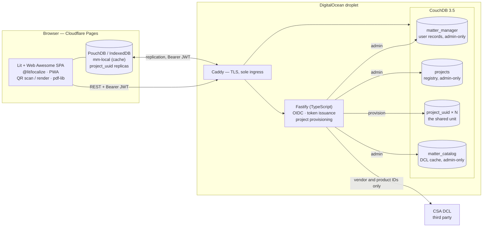

# Architecture

How Matter Manager is put together, and why. Decisions are recorded individually in
[`adr/`](adr/); this document is the map that connects them.

## The shape of the system

```mermaid
flowchart LR
  subgraph B["Browser — Cloudflare Pages"]
    UI["Lit + Web Awesome SPA<br/>@lit/localize · PWA<br/>QR scan / render · pdf-lib"]
    LOCAL[("PouchDB / IndexedDB<br/>mm-local (cache)<br/>project_uuid replicas")]
    UI --- LOCAL
  end

  subgraph D["DigitalOcean droplet"]
    CADDY["Caddy — TLS, sole ingress"]
    API["Fastify (TypeScript)<br/>OIDC · token issuance<br/>project provisioning"]
    subgraph CDB["CouchDB 3.5"]
      USERS[("matter_manager<br/>user records, admin-only")]
      REG[("projects<br/>registry, admin-only")]
      PROJ[("project_uuid × N<br/>the shared unit")]
      CAT[("matter_catalog<br/>DCL cache, admin-only")]
    end
    CADDY --> API
    CADDY --> CDB
    API -->|admin| USERS
    API -->|admin| REG
    API -->|provision| PROJ
    API -->|admin| CAT
  end

  DCL["CSA DCL<br/>third party"]
  API -->|"vendor and product IDs only"| DCL

  UI -->|"REST + Bearer JWT"| CADDY
  LOCAL <-->|"replication, Bearer JWT"| CADDY

  classDef store fill:#eef,stroke:#557
  class LOCAL,USERS,REG,PROJ,CAT store
```

## The two paths, and why they are separate

Data reaches the server by **two independent routes**, and that is the single most important
structural fact about the system.

**Device data replicates browser-to-CouchDB directly.** It never touches the API. The
browser authenticates to CouchDB with a JWT that CouchDB validates itself using a public
key. Putting the API on that path would place it in front of every document write, make it
a failure point for synchronisation, and gain nothing — CouchDB already enforces
authorisation through `_security` and `validate_doc_update`.

**The API handles only what replication cannot**: proving who someone is, listing projects,
serving the profile, creating databases the browser has no rights to create, and looking up
manufacturer and product names in the DCL ([ADR 0019](adr/0019-setup-code-to-own-api.md)).

This is why the OpenAPI contract has no device endpoints. Their absence is the design.

## Authentication

The system uses OIDC, but **the identity provider's own JWT is never used as an API or
CouchDB credential.** It is exchanged, once, for a token this project issues.

Two reasons. Every OIDC provider shapes its claims differently, so accepting them directly
would push provider-specific handling into CouchDB's `_security` and into every
authorisation check — and adding Facebook later would mean revisiting all of it. And CouchDB
must validate these tokens itself, which means we control the signing key and the claim
names, not Google.

Our tokens are **ES256** (EC P-256) rather than RS256: substantially smaller signatures on
every replication request, for equivalent security.

```mermaid
sequenceDiagram
  participant U as Browser
  participant A as Fastify API
  participant G as Google (OIDC)
  participant C as CouchDB

  U->>A: GET /auth/google
  A->>G: authorization code + PKCE
  G-->>A: ID token (provider-shaped)
  Note over A: verified, then discarded —<br/>never used as a credential
  A-->>U: mm_handoff cookie (120 s, single use)
  U->>A: POST /auth/token
  A-->>U: access token (5 min, plan in _couchdb.roles) + refresh token (30 days)
  U->>C: replication, Authorization: Bearer <access token>
  Note over C: validates with the EC public key alone;<br/>the API is not involved
  C-->>U: documents
```

### Which CouchDB settings are live, and which are not

The asymmetry here is easy to get backwards, and getting it backwards is expensive:

| Setting | Applied |
|---|---|
| `[chttpd] authentication_handlers` | **at startup only** |
| `[jwt_keys]` | **live**, on the next request |

Setting the handler at runtime returns `200` and does nothing until the node restarts — and
until then every request authenticates as **anonymous** rather than failing, which looks
exactly like a permissions bug. Production bakes the handler into the image
(`infra/couchdb/00-base.ini`), so it is active at boot and this never arises in operation.

Keys being live is what makes **zero-downtime key rotation** possible: add the new key under
a new `kid`, start issuing tokens with it, and remove the old key later. Both keys validate
throughout, and no replication is interrupted. Verified against CouchDB 3.5.2 and guarded in
CI by `infra/couchdb/verify-jwt-model.sh`.

## Packages

| Package | Contains | May depend on |
|---|---|---|
| `core` | Matter codec, room paths, entitlements, conflict merge, validation, types | nothing |
| `data` | PouchDB repositories, sync manager, conflict detection | `core` |
| `web` | Lit SPA, i18n, scanning, PDF | `core`, `data` |
| `api` | Fastify, OIDC, provisioning | `core` |

### Why `core` is the keystone

`core` has no I/O, no DOM, no network and no database. That constraint is load-bearing, for
three reasons.

**It is where the bugs live.** Bit-unpacking an 88-bit payload, deciding how two conflicting
remark arrays combine, determining whether someone may invite a member — this is the logic
that can be subtly, silently wrong. Wrapping it in infrastructure would make it slow to test
and therefore under-tested, exactly inverting where test effort should go.

**It is needed on both sides.** The browser decodes payloads when scanning; the API validates
them when provisioning. Written once, it cannot drift.

**It is a design forcing-function.** If something seems to need a database to test, it is
almost always two things tangled together: a pure decision and an impure action. Separating
them and putting the decision in `core` improves the design independently of testing.

## Offline-first

The local PouchDB replica is the client's source of truth. Writes go there and return
immediately; replication happens in the background and may fail without the user noticing.

**Exactly one operation requires connectivity: creating a project.** It needs a CouchDB
database created, a `_security` document written and a design document installed — all
admin operations. Everything else works with no network: adding devices, editing, moving,
adding remarks, generating PDFs.

Consequences that must be designed for, not discovered:

- **Conflicts are inevitable.** Anything append-shaped needs an explicit merge (ADR 0010).
- **JWTs expire while offline.** That is fine, because sync only matters online. Refresh on
  reconnect. A local write must never block on token freshness.
- **Revocation does not recall data.** Whatever replicated stays replicated (SECURITY.md).

## Authorisation

One CouchDB database per project (ADR 0003). CouchDB has no row-level read permission, and
filtered replication is not a security boundary — the filter runs after the read, so a
client talking to `_changes` directly bypasses it.

Read access is `_security.members.names`. Write access is a custom `writers.names` key
enforced by `validate_doc_update`. This was verified against CouchDB 3.5.2 before anything
was built on it, and the verification runs in CI
(`infra/couchdb/verify-access-model.sh`).

### Four stores, four different exposures

That same "no row-level read permission" fact governs the other server-side databases, and it lands
differently in each:

| Store | Client access | Why |
|---|---|---|
| `project_<uuid>` | **replicated**, per-project `_security` | The sharing boundary. One database is the only way to say "this house, not that one". |
| `projects` | **never** — API only | It holds every project's name, address and participant list. One readable database would disclose all of them to any authenticated user. |
| `matter_manager` | **never** — API only | One record per user (profile, plan, operator roles, refresh-token hashes), created on demand. Admin-only; profiles are served by `GET /profile`. |
| `matter_catalog` | **never** — API only | What the DCL says about vendors and models, cached for `POST /catalog/lookup`. Public data, admin-only because no browser needs it. Never holds a setup code. |

Clients never enumerate databases: `_all_dbs` is blocked at Caddy, and users discover
projects through `GET /projects`, which reads the registry server-side.

Because that call needs connectivity and the application does not, the browser keeps a
**local-only cache** of the result in `mm-local` — never replicated, single-writer, and never
consulted for authorisation. See [ADR 0012](adr/0012-central-project-registry.md).

## The projects page

The application lands on **Projects** (`/`), not on a device list: which project comes before
what is in it. Devices are at `/devices` and show the current project. Every device has at least
one project to open, because first run adopts the local catalogue.

The page is a join of three inputs, decided by one pure module (`projects-model.ts`, no DOM,
no PouchDB, no network): the local index in `mm-local` (what this device holds), the server list
(`GET /projects`, fresh, stale from the `cache:project:*` copy, or unheard) and the cached plan.
It yields, per row, a derived location (`local`, `server`, `synced`) and which actions are
allowed or why not. The view renders those answers and the actions (`project-actions.ts`) obey
them, so a rule is written and tested once. The plan and limit tables in `plan.ts` mirror the
backend's `can.ts`: there is no shared package, and the limit prefers the server-reported
`projectLimit`, so drift shows up as the server's number, not a wrong silent one.

Actions that move data are **promote** (local-only to server), **download** (server to a local
copy), **remove local copy** and **delete** (local-only, after typing the name). The order is
what keeps data safe: nothing is destroyed until a push has resolved (`SyncManager.pushNow`, a
`pushOnce` with `checkpoint: false` so a document the server refused counts as unpushed, which
the live sync's checkpoint would hide), the views move off a database before it is copied, and
the source's `update_seq` must be unchanged before the destroy. While an action runs it holds
the **busy registry** (`project-busy.ts`); the shell still reads facts during that time but does
not switch the project or rewrite the replication list, so a refresh cannot undo the action.

A read that spans an action (begun before or during it, finished after) is dropped whole: the
registry keeps an epoch that moves whenever an action begins or ends, and the idle refresh that
follows the action applies fresh facts.

Replication runs for **every indexed synchronized copy** and only those, handed over as a whole
set. A refused project reports `denied`; live sync keeps running (pulls are still valid), but the
shell shows the project as denied until a push of it succeeds or it leaves the replicated set, so
a later `idle` cannot hide the refusal. The page shows it as "No permission to sync", or
"Archived — read-only" for an archived project.

The header bar carries the email (or Sign in), the network state, the sync summary and Upgrade;
**Sign out** is the last item of the left navigation. Signing out first reads the index afresh
and pushes every synchronized copy once; the dialog then names every copy that may hold changes
the server lacks (a failed or timed-out push, everything offline, and copies of archived or
no-longer-listed projects, which cannot be pushed) and asks a second time before going on. It holds the busy registry throughout, then
destroys `mm-local` and the server copies, and keeps local-only projects unless "Also remove
projects stored only on this device" is ticked (the kept index entries are re-written into the
fresh `mm-local`). A refused refresh token ends the session without deleting anything.

Known limit: tabs are not coordinated, so an edit in a second tab during the last round trip of
a promote or removal is not protected ([#220](https://github.com/beyonddemise/matter-manager/issues/220)).

## Deployment

The SPA is static and deploys to Cloudflare Pages. The droplet runs Caddy, Fastify and
CouchDB under Docker Compose, with Caddy terminating TLS and acting as the only ingress.

CouchDB configuration is **baked into a derived image, never bind-mounted**. The upstream
entrypoint chowns everything under `/opt/couchdb` as root under `set -e`; a bind-mounted
file cannot be chowned, so the entrypoint exits 1 with no log output at all. This cost real
debugging time once and is documented in both Dockerfiles so it does not cost it again.

## Testing

| Layer | Tool | Gate |
|---|---|---|
| `core` | Vitest, node | 90% |
| `data` | Vitest + `pouchdb-adapter-memory` | 70% |
| `web` | Vitest browser mode + `@open-wc/testing-helpers` | 70% |
| `api` | Vitest + Fastify `.inject()`, live CouchDB | 70% |
| e2e | Playwright, including offline and conflict scenarios | — |
| CouchDB contract | `verify-access-model.sh` in CI | must pass |

The distribution is deliberate: most assertions live in `core`, where they are exhaustive
and run in milliseconds. E2E covers journeys that genuinely cross layers — offline creation
and reconnection, concurrent conflicting edits — and nothing that a unit test could cover
better.
