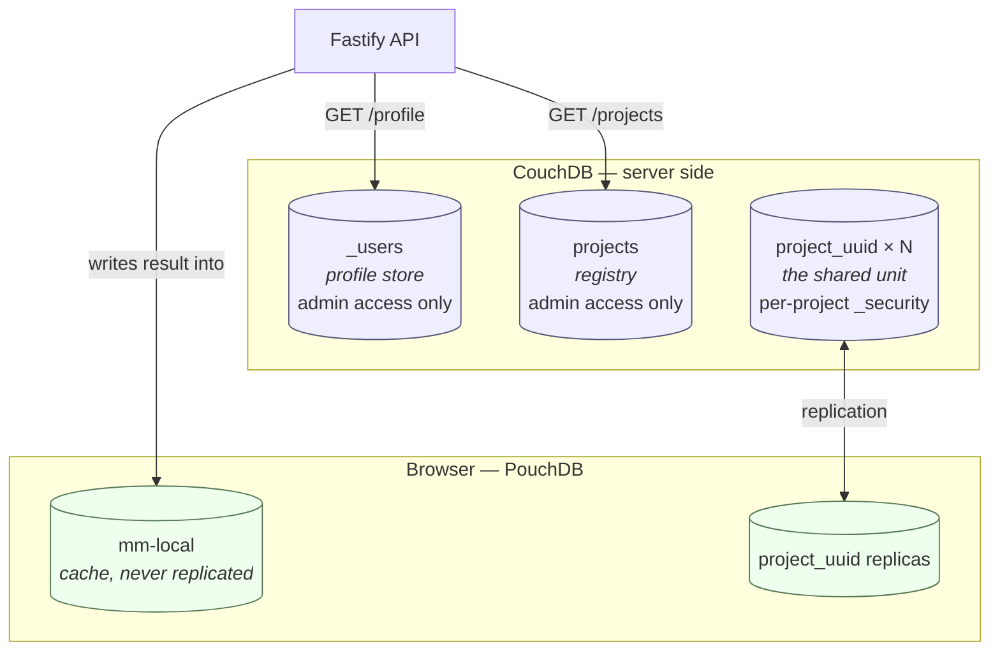

# Data model

Four stores. Three live in CouchDB; one lives only in the browser.



**Only `project_<uuid>` is ever replicated to a browser.** The other two CouchDB databases
are reachable through the API alone, and the fourth exists only on the client. That split is
the whole authorisation design — see [ADR 0003](adr/0003-database-per-project.md) and
[ADR 0012](adr/0012-central-project-registry.md).

---

## `_users` — a profile store, not an authentication store

CouchDB's built-in `_users` database. Never replicated.

**It is not what authenticates anyone.** Under JWT authentication CouchDB does not consult
`_users` at all: the token's `sub` claim becomes `userCtx.name` and roles come from
`_couchdb.roles`. A user with no `_users` document authenticates perfectly well — verified
against CouchDB 3.5.2. This database is used here because it is a convenient, already-secured
place to keep profiles, and for no other reason.

Two consequences that follow, and will surprise anyone who assumes otherwise:

- **Nothing keeps it in sync with reality.** An entry here is a profile record, not proof
  that an account exists or may sign in.
- **The browser cannot read it — not even its own document.** A JWT-authenticated request for
  `_users/org.couchdb.user:<sub>` returns `403`. Verified. Profiles are therefore served by
  `GET /profile`, and cached client-side like everything else the API owns.

User documents follow CouchDB's required shape (`name`, `type: "user"`, `roles`) with the
profile fields alongside. No password is set — password authentication is never used.

```jsonc
{
  "_id": "org.couchdb.user:auth0|abc123",
  "name": "auth0|abc123",       // must equal the id suffix; also the JWT `sub`
  "type": "user",               // required by CouchDB's own validation
  "roles": [],
  "displayName": "Stephan",
  "email": "someone@example.com",
  "locale": "auto",             // "auto" | "en" | "de" — "auto" follows the browser
  "theme": "auto",
  "plan": "free",               // the entitlement seam reads this; see ADR 0009
  "createdAt": "2026-08-19T08:00:00.000Z"
}
```

`plan` exists from the first migration even though nothing consults it yet. That is the point
of [ADR 0009](adr/0009-entitlement-seam-billing-deferred.md): `can(principal, action, project)`
has somewhere to look when there is finally an answer, so choosing a billing model later
changes one file rather than requiring a schema migration across every existing account.

When updating a profile, read-modify-write the whole document. Never drop `roles`, and never
introduce a `password` field.

---

## `projects` — the registry

One document per project, listing who may access it. **Admin access only; never replicated
to a client, and never made a member-readable database.**

That constraint is not a precaution, it is the design. CouchDB has no row-level read
permission, so a `projects` database readable by authenticated users would disclose *every*
project's name, address and participant list to *every* user. Project names here are street
addresses, and `participants` is a map of who has access to whose home.

```jsonc
{
  "_id": "project:8f14e45f-ceea-467a-9c0e-1b2c3d4e5f60",
  "type": "projectPointer",
  "projectId": "8f14e45f-ceea-467a-9c0e-1b2c3d4e5f60",
  "dbName": "project_8f14e45f_ceea_467a_9c0e_1b2c3d4e5f60",
  "projectName": "Musterstraße 12",
  "participants": [
    // role: owner | manage | write | read
    { "role": "owner", "userid": "auth0|abc123" },
    { "role": "read", "userid": "auth0|def456" }
  ],
  "addedAt": "2026-08-19T08:00:00.000Z"
}
```

### Listing a user's projects needs a view

Answering "which projects may this user see?" without an index means scanning every project
document on the server. A view emitting one row per participant is required:

```js
// projects/_design/by_participant, view "by_user"
function (doc) {
  if (doc.type === 'projectPointer' && doc.participants) {
    doc.participants.forEach(function (p) {
      emit(p.userid, { projectId: doc.projectId, dbName: doc.dbName,
                       projectName: doc.projectName, role: p.role })
    })
  }
}
```

`GET /projects` is then `_view/by_user?key="<sub>"`. Verified working against CouchDB 3.5.2.

### One document per project means membership writes contend

All participants live in a single document, so two concurrent membership changes to the same
project conflict. The API is the only writer, so this is handled with `_rev` and a retry on
`409` — not with the merge strategies used for device documents. Volume is low; it simply
must not be forgotten.

---

## `mm-local` — the client's cache

A PouchDB database that exists **only in the browser and is never given a remote
counterpart.** Written solely by the client, from the result of `GET /projects` and
`GET /profile`.

It exists because removing the per-user database removed the client's ability to discover
projects offline. Everything else in the application works without connectivity; this keeps
project discovery in that category.

```jsonc
{
  "_id": "project:8f14e45f-ceea-467a-9c0e-1b2c3d4e5f60",
  "type": "cachedProject",
  "dbName": "project_8f14e45f_ceea_467a_9c0e_1b2c3d4e5f60",
  "projectName": "Musterstraße 12",
  "myRole": "owner",
  "fetchedAt": "2026-08-19T08:00:00.000Z",   // when the server last confirmed this
  "localState": "downloaded",                 // not-downloaded | syncing | downloaded
  "lastSyncedAt": "2026-08-19T09:12:00.000Z"
}
```

**`fetchedAt` and `localState` answer different questions, and both are needed.** The server
list says what you *may* access; `localState` says what you *actually have* on this device.
They diverge constantly — a project granted on your phone is not downloaded on your laptop —
and only the second answers "what can I open on a train", which is what the UI needs. It also
gives an honest indicator: *3 of 5 projects available offline*.

Three properties to preserve:

- **Single writer.** Only this browser writes it, so it has no conflicts and needs no merge
  logic — uniquely among the stores here.
- **It is a cache, not a source of truth.** Nothing reads it to make an authorisation
  decision. It decides only what to *attempt*; CouchDB's `_security` decides what succeeds.
- **It goes stale in the permissive direction.** A project whose access was revoked stays
  listed until the next successful fetch. That is not a new exposure — the local replica
  already holds the data ([SECURITY.md](../SECURITY.md)) — but replication will begin
  returning `403`, and the UI must show *access removed* rather than appearing broken.

Cleared on sign-out, along with the project replicas.

## `project_<uuid>` — one per project

The unit of sharing. See [ADR 0003](adr/0003-database-per-project.md).

### `meta:project`

```jsonc
{
  "_id": "meta:project",
  "type": "projectMeta",
  "name": "Musterstraße 12",
  "address": "12 Musterstraße, 12345 Musterstadt",
  "ownerType": "user",       // "user" | "org" — polymorphic from day one (ADR 0011)
  "ownerId": "auth0|abc123",
  "createdAt": "2026-08-19T08:00:00.000Z",
  "schemaVersion": 1
}
```

`ownerType`/`ownerId` are never compared directly. Every check goes through
`isOwner(principal, project)` in `core`, which is what makes organisations a later addition
rather than a later migration.

### `room:<uuid>`

```jsonc
{
  "_id": "room:3fa85f64-5717-4562-b3fc-2c963f66afa6",
  "type": "room",
  "path": "Ground Floor/Kitchen",   // materialised path, "/" separated (ADR 0006)
  "sortKey": 100,
  "updatedAt": "2026-08-19T08:00:00.000Z"
}
```

Hierarchy is derived by splitting `path`. There is no `parentId`, which is precisely why
there are no reparenting conflicts to resolve under offline sync.

### `device:<uuid>`

```jsonc
{
  "_id": "device:6ba7b810-9dad-11d1-80b4-00c04fd430c8",
  "type": "device",
  "name": "Kitchen ceiling light",
  "roomId": "room:3fa85f64-5717-4562-b3fc-2c963f66afa6",
  "spot": "ceiling, north end",     // free text the room name cannot capture

  // --- from the QR code ---
  "payload": "MT:Y.K9042C00KA0648G00",
  "manualCode": "34970112332",
  "vendorId": 65521,                // 0xFFF1
  "productId": 32768,               // 0x8000
  "discriminator": 3840,
  "vendorName": "Example GmbH",     // from the DCL lookup, may be absent
  "productName": "Smart Bulb A60",
  "deviceTypeId": 266,

  // --- user metadata ---
  "serial": "SN-000123",
  "installedAt": "2026-08-19",      // defaults to the scan date
  "addedAt": "2026-08-19T08:00:00.000Z",
  "updatedAt": "2026-08-19T08:00:00.000Z",
  "disabled": false,
  "disabledAt": null,

  "remarks": [
    {
      "id": "9f8e7d6c-1234-4567-89ab-cdef01234567",
      "text": "Replaced batteries",
      "authorSub": "auth0|abc123",
      "authorName": "Stephan",
      "createdAt": "2026-08-19T09:30:00.000Z"
    }
  ]
}
```

`_attachments` carries device photos, downscaled client-side before saving — attachments
replicate in full and are by far the largest driver of sync bandwidth.

**`payload` is a secret.** It contains the setup passcode. Never log it, never send it to a
third party (the DCL lookup sends vendor and product ids only), and never include it in a
bug report. See [SECURITY.md](../SECURITY.md).

**Remark ids are client-generated UUIDs**, not indices or counts. The conflict merge unions
by id, and positional identity would make "the same remark twice" indistinguishable from
"two different remarks".

### `audit:<iso>-<uuid>`

```jsonc
{
  "_id": "audit:2026-08-19T09:30:00.000Z-9f8e7d6c",
  "type": "audit",
  "actor": "auth0|abc123",
  "action": "device.disabled",
  "targetId": "device:6ba7b810-9dad-11d1-80b4-00c04fd430c8",
  "before": { "disabled": false },
  "after": { "disabled": true },
  "at": "2026-08-19T09:30:00.000Z"
}
```

Append-only and immutable, enforced by `validate_doc_update`. Because nothing ever rewrites
them, **audit entries cannot conflict** — a property worth preserving deliberately.

## Conflicts

CouchDB detects conflicts and picks a deterministic winner. It does not merge. Without an
explicit strategy, a remark added offline on one device silently disappears when another
device's revision wins — the worst kind of bug, because nobody notices and so nobody reports
it.

`core` owns the strategies; `data` applies them on every change event.

| Shape | Strategy |
|---|---|
| `remarks` | Union by `id`, sorted by `createdAt`. Nothing is discarded. |
| Scalars (`name`, `roomId`, `disabled`, `spot`) | Last write wins by `updatedAt`. |
| `room.path` | Last write wins. A deleted room still referenced by a live device is resurrected as `Unassigned/<old path>`. |
| `audit:*` | Cannot conflict — append-only. |

Losing revisions are deleted after a successful merge, or `_conflicts` grows without bound
and every read pays for it.

See [ADR 0010](adr/0010-embedded-remarks-conflict-merge.md).

## Identifiers

- Documents use a `type:` prefix (`device:`, `room:`, `audit:`) so ranged `_all_docs` queries
  can select a kind without a view.
- Database names replace UUID hyphens with underscores: CouchDB database names are
  restricted to `[a-z][a-z0-9_$()+/-]*`, and underscores avoid ambiguity in URLs.
- `schemaVersion` on `meta:project` drives migrations. Migrations must be able to run against
  a replica that has been offline for months, so they must be idempotent and must never
  assume they run exactly once.
