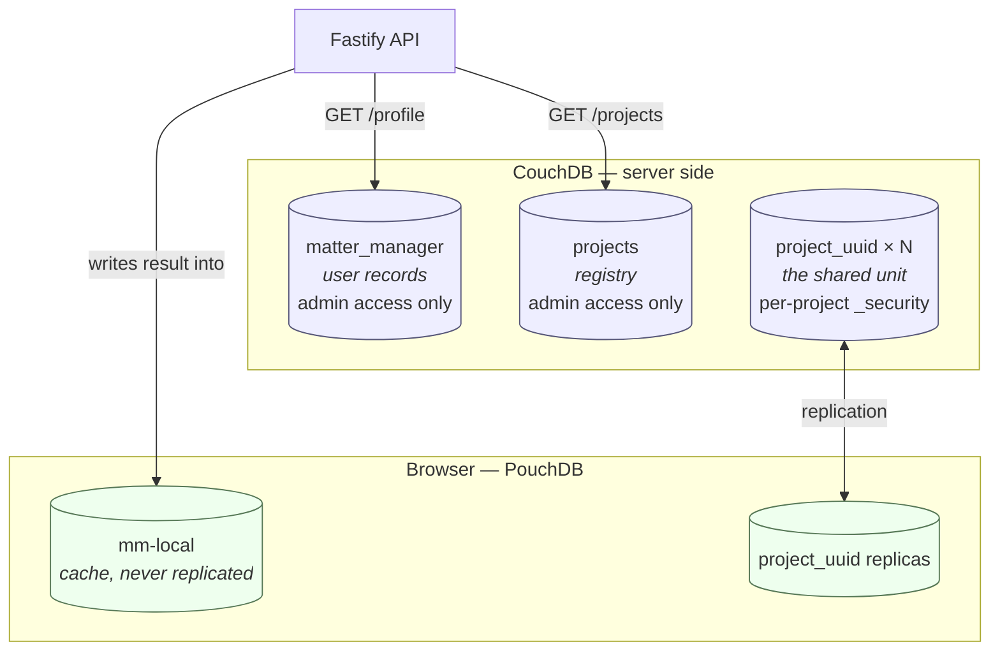

# Data model

Four stores. Three live in CouchDB; one lives only in the browser.


```mermaid
flowchart TB
  subgraph SERVER["CouchDB — server side"]
    U[("matter_manager<br/><i>user records</i><br/>admin access only")]
    R[("projects<br/><i>registry</i><br/>admin access only")]
    P[("project_uuid × N<br/><i>the shared unit</i><br/>per-project _security")]
  end
  subgraph CLIENT["Browser — PouchDB"]
    L[("mm-local<br/><i>cache, never replicated</i>")]
    PR[("project_uuid replicas")]
  end
  API["Fastify API"]
  API -->|GET /profile| U
  API -->|GET /projects| R
  API -->|writes result into| L
  P <-->|replication| PR
  classDef srv fill:#eef,stroke:#557
  classDef cli fill:#efe,stroke:#575
  class U,R,P srv
  class L,PR cli
```

**Only `project_<uuid>` is ever replicated to a browser.** The other two CouchDB databases
are reachable through the API alone, and the fourth exists only on the client. That split is
the whole authorisation design — see [ADR 0003](adr/0003-database-per-project.md) and
[ADR 0012](adr/0012-central-project-registry.md).

---

## `matter_manager` — user records, not an authentication store

One record per person, keyed by verified address (`user:<base64url of the lower-cased address>`)
and **created on demand**: by accepting an invitation, `PATCH /profile`, `PUT /waitlist`, or an operator's
`PUT /customer`. A plain sign-in creates none; such a user is `free` and their profile is built
from their token. Admin access only; never replicated. This replaces the earlier use of
CouchDB's built-in `_users`.

**It is not what authenticates anyone.** Under JWT authentication CouchDB does not consult any
user database: the token's `sub` claim becomes `userCtx.name` and roles come from
`_couchdb.roles`, which the API fills with the record's plan at each mint. The browser cannot
read this database, so profiles are served by `GET /profile` and cached client-side.

```jsonc
{
  "_id": "user:c29tZW9uZUBleGFtcGxlLmNvbQ",
  "type": "user",
  "sub": "auth0|abc123",        // absent until the owner first signs in, if an operator created it
  "email": "someone@example.com",
  "displayName": "Stephan",
  "locale": "auto",             // "auto" | "en" | "de"
  "plan": "free",               // "free" | "member" | "pro"; absent means free (ADR 0009)
  "planRequested": "pro",       // waitlist (#224): "member" | "pro"; a request, not a plan
  "requestedAt": "2026-10-09T08:00:00.000Z", // set and cleared together with planRequested
  "roles": [],                  // set by hand in Fauxton; only "customerservice" is read
  "refreshTokens": [{ "hash": "<sha256(jti)>", "exp": 1790000000, "createdAt": 1787400000 }]
}
```

Writes name their fields, so no request body can set `roles`, `plan` (other than through the
operator-gated routes), `sub`, `email` or `refreshTokens`. (The waitlist routes write only
`planRequested` and `requestedAt`, which are a request and never an entitlement.)
A `by_sub` view resolves a record by subject and skips records without one. A
`by_plan_requested` view lists waiting records by `[planRequested, requestedAt]`, valued by
address, for operators (the query is in `backend/README.md`); the API never reads it. See
[SECURITY-MODEL.md](SECURITY-MODEL.md), *User records and tokens*.

---

## `matter_catalog` — the DCL cache

What the CSA's Distributed Compliance Ledger said about each vendor and model, and when.
**Admin access only; never replicated.** Created by the API on the first lookup, with
`_security` written before anything else. A cache, not a source of truth: every document can
be fetched again. Document IDs use **decimal** IDs, as the DCL's own paths do.

Each document keeps the DCL record **raw**, minus `creator`, so a field the app starts using
later needs no re-fetch. `dcl` is present exactly when `status` is `found`.

```jsonc
{ "_id": "vendor:4447", "type": "vendor", "vid": 4447, "status": "found",
  "fetchedAt": "2026-10-05T16:20:00.000Z", "network": "mainnet",
  "dcl": { "vendorID": 4447, "vendorName": "Aqara", "companyLegalName": "Lumi United Technology Co., Ltd.",
           "companyPreferredName": "", "vendorLandingPageURL": "https://www.aqara.com/", "schemaVersion": 0 } }

{ "_id": "model:4447:9999", "type": "model", "vid": 4447, "pid": 9999, "status": "missing",
  "fetchedAt": "2026-10-05T16:20:00.000Z", "network": "mainnet" }
```

A found entry is refreshed after 90 days, a miss after one day, and an old entry is served
with `stale: true` when the DCL cannot be reached. `network` is `mainnet`, `testnet` or
`other`, from `DCL_BASE_URL`. The view `_design/catalog/by_fetched` emits `fetchedAt`, for a
future "refresh all".

**The setup code is never stored here**, or anywhere else on the server. Only the two IDs
decoded from it survive the request.

---

## `projects` — the registry

One document per project, listing who may access it. **Admin access only; never replicated
to a client, and never made a member-readable database.**

That constraint is not a precaution, it is the design. CouchDB has no row-level read
permission, so a `projects` database readable by authenticated users would disclose *every*
project's name, address and participant list to *every* user. Project names here are street
addresses, and `participants` is a map of who has access to whose home.

`dbName` keeps the uuid's hyphens. CouchDB permits them — this repository's own
`infra/couchdb/verify-access-model.sh` creates `verify-access-model-$$` against a real server —
and an earlier version of this example replaced them with underscores, which disagreed with
ADR 0003 and with the OpenAPI contract. One representation, produced by one function:
`projectDatabaseName()` in `backend/src/projects/names.ts`, which refuses anything that is
not a lower-case v4 uuid.

```jsonc
{
  "_id": "project:8f14e45f-ceea-467a-9c0e-1b2c3d4e5f60",
  "type": "projectPointer",
  "projectId": "8f14e45f-ceea-467a-9c0e-1b2c3d4e5f60",
  "dbName": "project_8f14e45f-ceea-467a-9c0e-1b2c3d4e5f60",
  "projectName": "Musterstraße 12",
  "client": "Familie Muster",       // optional free text, at most 200 characters; absent when none
  "archived": false,                // absent reads as false
  "archivedAt": 1790000000,         // seconds since the epoch; present only while archived
  "participants": [
    // role: owner | manage | write | read
    { "role": "owner", "userid": "auth0|abc123" },
    { "role": "read", "userid": "auth0|def456" }
  ],
  "addedAt": "2026-08-19T08:00:00.000Z"
}
```

`client` is who the project is for, in the owner's words: trimmed, bounded like a name, absent
rather than empty. It is accepted by `POST /projects` and `PATCH /projects/:id`, and a `null` on
PATCH removes it. `archivedAt` is stamped once by the `archived: true` event (a repeat does not
move it), removed by `archived: false`, and is what the 90-day hard delete (#208) will read.
`ProjectSummary` carries `client` when present and `archivedAt` when archived, and always
carries `archived`. Archived projects do not count toward the plan limit.

### Listing a user's projects needs a view

Answering "which projects may this user see?" without an index means scanning every project
document on the server. A view emitting one row per participant is required:

```js
// projects/_design/by_participant, view "by_user"
function (doc) {
  if (doc.type === 'projectPointer' && doc.participants) {
    // The owner is emitted with every row. `ProjectSummary` in the contract requires one, and
    // a row describes a single participant - without this the API would read every pointer
    // again to render a list.
    var ownerId = null
    doc.participants.forEach(function (p) {
      if (p.role === 'owner' && ownerId === null) ownerId = p.userid
    })
    doc.participants.forEach(function (p) {
      emit(p.userid, { projectId: doc.projectId, dbName: doc.dbName,
                       projectName: doc.projectName, role: p.role,
                       ownerId: ownerId })
    })
  }
}
```

`GET /projects` is then `_view/by_user?key="<sub>"`. Verified working against CouchDB 3.5.2.

### One document per project means membership writes contend

All participants live in a single document, so two concurrent membership changes to the same
project conflict. The API is the only writer, so this is handled with `_rev` and a retry on
`409` — not with the merge strategies used for device documents. Volume is low; it simply
must not be forgotten.

---

## `mm-local` — the client's cache

A PouchDB database that exists **only in the browser and is never given a remote
counterpart.** Written solely by the client, from the result of `GET /projects` and
`GET /profile`.

It exists because removing the per-user database removed the client's ability to discover
projects offline. Everything else in the application works without connectivity; this keeps
project discovery in that category.

```jsonc
{
  "_id": "cache:project:8f14e45f-ceea-467a-9c0e-1b2c3d4e5f60",
  "type": "cachedProject",
  "dbName": "project_8f14e45f-ceea-467a-9c0e-1b2c3d4e5f60",
  "projectName": "Musterstraße 12",
  "myRole": "owner",
  "fetchedAt": "2026-08-19T08:00:00.000Z",   // when the server last confirmed this
  "localState": "downloaded",                 // not-downloaded | syncing | downloaded
  "lastSyncedAt": "2026-08-19T09:12:00.000Z"
}
```

**`fetchedAt` and `localState` answer different questions, and both are needed.** The server
list says what you *may* access; `localState` says what you *actually have* on this device.
They diverge constantly — a project granted on your phone is not downloaded on your laptop —
and only the second answers "what can I open on a train", which is what the UI needs. It also
gives an honest indicator: *3 of 5 projects available offline*.

Three properties to preserve:

- **Single writer.** Only this browser writes it, so it has no conflicts and needs no merge
  logic — uniquely among the stores here.
- **It is a cache, not a source of truth.** Nothing reads it to make an authorisation
  decision. It decides only what to *attempt*; CouchDB's `_security` decides what succeeds.
- **It goes stale in the permissive direction.** A project whose access was revoked stays
  listed until the next successful fetch. That is not a new exposure — the local replica
  already holds the data ([SECURITY.md](../SECURITY.md)) — but replication will begin
  returning `403`, and the UI must show *access removed* rather than appearing broken.

**The cached list doubles as the last-known server list.** The projects page is built from what
this device holds plus what the server said. When the server cannot be asked (offline, a failed
request, or the token exchange not yet answered, the `checking` session) the page reads these
`cache:project:*` documents instead and flags the list stale: counts, roles and archived state
are taken from it, so an offline member with five server projects still cannot create a sixth,
but every act that needs the server is refused. The list can be up to a session old.

Cleared on sign-out, along with the project replicas.

### The local index: `local:project:<dbName>`

Also in `mm-local`, also never replicated: one document per project database **this device
holds**, whether local-only or a downloaded copy of a server project. IndexedDB cannot be
enumerated everywhere (`indexedDB.databases()` is missing from Firefox before 126), so what the
browser holds has to be written down. Addressed by database name, so the index is a listable key
range and one database has exactly one entry (`LocalProjectEntry`, `frontend/src/data/local-cache.ts`).

```jsonc
{
  "_id": "local:project:project_local_5b1c0c9e-3a52-4f0e-9b5b-6f0f6e1d2a77",
  "dbName": "project_local_5b1c0c9e-3a52-4f0e-9b5b-6f0f6e1d2a77",
  "name": "Musterstraße 12",
  "client": "Familie Muster",     // absent rather than empty
  "projectId": "8f14e45f-...",    // the server's id; absent while local-only
  "role": "owner",                // owner | manage | write | read; meaningless while local-only
  "createdAt": "2026-10-03T08:00:00.000Z"
}
```

- **A project's location is derived, never stored:** in the index only is `local`, in the server
  list only is `server`, in both is `synced`. An archived project's copy reads `local` (it can no
  longer be written), as does a copy the fresh list no longer names (an orphan).
- **`role` is recorded on download and promote** so an offline device can tell a downloaded
  *shared* project from an owned one: owned ones count against the plan limit. Missing on an
  entry with a `projectId` reads as owner, because miscounting a project as owned can only
  refuse a create that would have fitted.
- **The index is not authority for "is the data elsewhere".** A promotion records `projectId` on
  the local entry the moment `POST /projects` answers, before any data has moved, so the
  *database name* decides (`isLocalOnlyDatabase`): `project_local` and `project_local_<uuid>`
  are local-only whatever the entry says.
- Rewritten by the same revision-retry loop as the rest of `mm-local`. On sign-out the index is
  destroyed with `mm-local`, and the entries of the local-only projects that were kept are
  written again into the fresh one.

### Database naming on the device

| Name | What it is |
|---|---|
| `project_<uuid>` | A synchronized project. **The local name equals the server's `dbName`**, so replication pairs the two by name. Downloading creates it; promoting copies into it. |
| `project_local_<uuid>` | A local-only project created on this device (`createLocalProject`). |
| `project_local` | The first-run catalogue from before projects had ids. Never renamed, so nothing moves; adopted into the index at first launch. |

A **promote** copies `project_local_<uuid>` into `project_<id>`, pushes, and only then destroys
the source. The destroy is guarded by the source's `update_seq` (unchanged since the copy, or the
transfer is repeated once and then refused), so an edit that lands mid-transfer is not destroyed
unsent. A step refused midway leaves an unindexed, partial `project_<id>` and keeps the source.
The views wrote into the survivor from the moment the copy began, so before they move back the
survivor is replicated into the source (without its `project` document): an edit made during a
refused promote is in the source, not stranded in the unindexed copy. If only the source's
destroy fails, both entries carry the project id and the page shows the server-named copy alone.

**First run adopts `project_local` only on a device that never knew a project:** nothing indexed
and no server list ever remembered. Then every device has one project to name ("Name your
project"). A device that once knew projects and has none left shows the create prompt instead.

## `project_<uuid>` — one per project

The unit of sharing. See [ADR 0003](adr/0003-database-per-project.md).

### `project` — the database describes itself

```jsonc
{ "_id": "project", "type": "project", "name": "Musterstraße 12", "client": "Familie Muster",
  "serverDb": "project_8f14e45f-ceea-467a-9c0e-1b2c3d4e5f60" }
```

Replicated to every device with the data, so a replica can name and locate itself without asking
the registry. **On a device it is also the truth for local-only projects:** the frontend writes it into
`project_local_<uuid>` (without `serverDb`), and the `mm-local` index entry mirrors its name so a
list renders without opening a database per row. Every rename writes the document first, then the
entry, so a failure between the two leaves the truth ahead. On a server database only the service
writes it. Fixed `_id` (`PROJECT_DOCUMENT_ID`). `client` is absent when the project has none.
Written by the API as server admin (which bypasses the validator) at provisioning, before the
pointer, so a half-made project is rolled back whole. **It is kept in step with the pointer by
every `PATCH /projects/:id`**, after the pointer is written: the document is compared with
itself, not with the pointer, so a repeated PATCH heals one whose earlier write failed, and a
database provisioned before the document existed gets one. A failed sync is a 500 rather than
swallowed, and the pointer stays the source of truth for listing. A document with the right
name but a wrong or missing `type` counts as stale and is rewritten too. **Only the service may
write it:** `_design/access` refuses any non-admin create, update or deletion of `_id: "project"`,
so a participant cannot rename the project on every replica behind the registry's back.

### `_security` — who the database lets in

Built only by `securityFor` (`backend/src/domain/membership.ts`), from the pointer's
participants:

```jsonc
{ "members": { "names": ["<everybody>"], "roles": [] },
  "writers": { "names": ["<owner, manage, write>"] },
  "owners":  { "names": ["<owner>"] },
  "archived": true }                // only while the pointer says archived; absent otherwise
```

`writers`, `owners` and `archived` are custom keys CouchDB preserves and `_design/access` reads.
`owners` lets the validator refuse writes from an owner whose plan has neither the `member` nor
the `pro` role (see SECURITY-MODEL.md); it moves with every membership change and transfer in the
same write. `archived` makes an archived project read-only for everybody but the server admin.
`securityFor(participants, { archived })` takes the pointer's archived state as a required
argument, so every writer (provisioning, membership changes, accepting a transfer, archiving and
unarchiving) carries it through: a membership change or transfer of an archived project keeps it
archived. A `PATCH` that names `archived` writes `_security` — before the pointer when archiving,
after it when unarchiving (the `narrowsAccess` rule) — and a repeated PATCH heals a failed write.

### `meta:project`

```jsonc
{
  "_id": "meta:project",
  "type": "projectMeta",
  "name": "Musterstraße 12",
  "address": "12 Musterstraße, 12345 Musterstadt",
  "ownerType": "user",       // "user" | "org" — polymorphic from day one (ADR 0011)
  "ownerId": "auth0|abc123",
  "createdAt": "2026-08-19T08:00:00.000Z",
  "schemaVersion": 1
}
```

`ownerType`/`ownerId` are never compared directly. Every check goes through
`isOwner(principal, project)` in `core`, which is what makes organisations a later addition
rather than a later migration.

### `room:<uuid>`

```jsonc
{
  "_id": "room:3fa85f64-5717-4562-b3fc-2c963f66afa6",
  "type": "room",
  "path": "Ground Floor/Kitchen",   // materialised path, "/" separated (ADR 0006)
  "sortKey": 100,
  "updatedAt": "2026-08-19T08:00:00.000Z"
}
```

Hierarchy is derived by splitting `path`. There is no `parentId`, which is precisely why
there are no reparenting conflicts to resolve under offline sync.

### `device:<uuid>`

```jsonc
{
  "_id": "device:6ba7b810-9dad-11d1-80b4-00c04fd430c8",
  "type": "device",
  "name": "Kitchen ceiling light",
  "roomId": "room:3fa85f64-5717-4562-b3fc-2c963f66afa6",
  "spot": "ceiling, north end",     // free text the room name cannot capture

  // --- from the QR code, decoded locally when the device is added ---
  "payload": "MT:Y.K9042C00KA0648G00",
  "manualCode": "34970112332",
  "vendorId": 65521,                // 0xFFF1
  "productId": 32768,               // 0x8000
  "discriminator": 3840,
  "payloadVersion": 0,              // payload only
  "commissioningFlow": "standard",  // standard | userActionRequired | custom | reserved; payload only
  "discovery": { "softAp": false, "ble": true, "onNetwork": false },  // payload only

  // --- the catalogue block: copied from the DCL lookup, written and merged as a unit ---
  "vendorName": "Example GmbH",
  "vendorPreferredName": "Example",
  "productName": "Smart Bulb A60",
  "deviceTypeId": 266,
  "partNumber": "A60-E27",
  "productUrl": "https://example.com/a60",          // https: only, as are the next three
  "supportUrl": "https://example.com/support",
  "userManualUrl": "https://example.com/a60.pdf",
  "commissioningFlowUrl": "https://example.com/pair",
  "commissioningInstructions": "Switch it on and off three times.",  // plain text
  "factoryResetInstructions": "Switch it on and off six times.",     // plain text
  "catalogCheckedAt": "2026-08-19T08:00:00.000Z",
  "catalogSource": "found",         // found | missing | test-vendor | unusable

  // --- user metadata ---
  "serial": "SN-000123",
  "installedAt": "2026-08-19",      // defaults to the scan date
  "addedAt": "2026-08-19T08:00:00.000Z",
  "updatedAt": "2026-08-19T08:00:00.000Z",
  "disabled": false,
  "disabledAt": null,

  "remarks": [
    {
      "id": "9f8e7d6c-1234-4567-89ab-cdef01234567",
      "text": "Replaced batteries",
      "authorSub": "auth0|abc123",
      "authorName": "Stephan",
      "createdAt": "2026-08-19T09:30:00.000Z"
    }
  ]
}
```

**Every field below `discriminator` is optional.** A device added before these fields existed,
or from an 11-digit code, simply lacks them; nothing migrates. The catalogue block is filled when
the device is added online, or later by backfill, and an empty DCL value is left out rather than
stored as `""`. A `missing` result is asked again after a day. An `unusable` result means our API
refused the stored code; it is never asked again. The copied fields are read-only in the edit
form.

`_attachments` carries device photos, downscaled client-side before saving — attachments
replicate in full and are by far the largest driver of sync bandwidth.

**`payload` is a secret.** It contains the setup passcode. Never log it, never send it to a
third party, and never include it in a bug report. See [SECURITY.md](../SECURITY.md). The one
place it travels other than replication is `POST /catalog/lookup`: to our own API, in a POST
body, decoded in memory and never stored. Only the vendor and product IDs reach the DCL
([ADR 0019](adr/0019-setup-code-to-own-api.md)).

**Remark ids are client-generated UUIDs**, not indices or counts. The conflict merge unions
by id, and positional identity would make "the same remark twice" indistinguishable from
"two different remarks".

### `audit:<iso>-<uuid>`

```jsonc
{
  "_id": "audit:2026-08-19T09:30:00.000Z-9f8e7d6c",
  "type": "audit",
  "actor": "auth0|abc123",
  "action": "device.disabled",
  "targetId": "device:6ba7b810-9dad-11d1-80b4-00c04fd430c8",
  "before": { "disabled": false },
  "after": { "disabled": true },
  "at": "2026-08-19T09:30:00.000Z"
}
```

Append-only and immutable, enforced by `validate_doc_update`. Because nothing ever rewrites
them, **audit entries cannot conflict** — a property worth preserving deliberately.

## Conflicts

CouchDB detects conflicts and picks a deterministic winner. It does not merge. Without an
explicit strategy, a remark added offline on one device silently disappears when another
device's revision wins — the worst kind of bug, because nobody notices and so nobody reports
it.

`core` owns the strategies; `data` applies them on every change event.

| Shape | Strategy |
|---|---|
| `remarks` | Union by `id`, sorted by `createdAt`. Nothing is discarded. |
| Scalars (`name`, `roomId`, `disabled`, `spot`) | Last write wins by `updatedAt`. |
| Catalogue block (`vendorName` … `catalogSource`) | Taken whole from the revision with the newest `catalogCheckedAt`, ties by `(updatedAt, _rev)`. |
| `room.path` | Last write wins. A deleted room still referenced by a live device is resurrected as `Unassigned/<old path>`. |
| `audit:*` | Cannot conflict — append-only. |

Losing revisions are deleted after a successful merge, or `_conflicts` grows without bound
and every read pays for it.

See [ADR 0010](adr/0010-embedded-remarks-conflict-merge.md).

## Identifiers

- Documents use a `type:` prefix (`device:`, `room:`, `audit:`) so ranged `_all_docs` queries
  can select a kind without a view.
- Database names replace UUID hyphens with underscores: CouchDB database names are
  restricted to `[a-z][a-z0-9_$()+/-]*`, and underscores avoid ambiguity in URLs.
- `schemaVersion` on `meta:project` drives migrations. Migrations must be able to run against
  a replica that has been offline for months, so they must be idempotent and must never
  assume they run exactly once.
